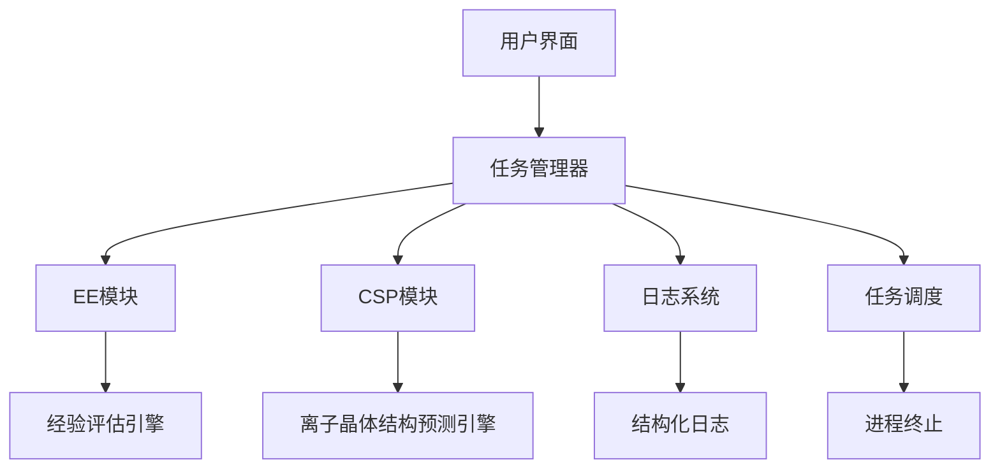

# 基于分子/离子构型的晶体结构设计软件 V2.3.4

[](https://github.com/Bagabaga007/ion_CSP)
[](https://www.python.org/)
[](LICENSE)

> 测试徽章和下方统计是 V2.3.0 的历史基线；V2.3.4 的修复和验证记录见 [CHANGELOG.md](CHANGELOG.md)。

## 项目概述

基于分子/离子构型的晶体结构设计软件通过结合经验公式、机器学习势函数微调、第一性原理分步优化和分子/离子识别技术，实现了从分子/离子构型出发的高效晶体结构设计。该软件采用模块化设计，支持全流程自动化材料筛选，在保证预测精度的同时显著提升计算效率。

## 🎯 功能特性

### 核心功能

- **双模块工作流**
  - **EE模块**：基于经验评估的离子组合生成
  - **CSP模块**：基于离子晶体结构预测的优化筛选
- **智能任务管理**
  - 实时进程监控（PID跟踪）
  - 日志文件自动符号链接
  - 进程安全终止与资源清理
- **高级日志系统**
  - 分页浏览（10条/页）
  - 模块过滤（CSP/EE）
  - 软链接解析显示实际路径

### 技术特性

- 跨平台支持（Linux/Docker）
- 基于Python 3.11+的面向对象架构
- 集成psutil进程管理
- 结构化日志记录系统
- **测试分层基线**（V2.3.0：420个测试，99.39%覆盖率；当前状态见 CHANGELOG）

## 📊 质量保证

### 测试统计（V2.3.0 历史基线）

| 测试层级 | 测试数量 | 覆盖率 | 状态 |
| ------- | -------- | ----- | ---- |
| 单元测试 | 338 | 99.39% | ✅ |
| 集成测试 | 48 | 85%+ | ✅ |
| 配置项测试 | 31 | N/A | ✅ |
| 系统测试 | 3 | N/A | ✅ |
| **总计** | **420** | **99.39%** | ✅ |

### 测试特点

- ✅ **0个跳过测试** - 所有测试都能实际运行
- ✅ **快速执行** - 完整测试套件60秒内完成
- ✅ **自动清理** - 测试后自动清理临时文件
- ✅ **跨平台兼容** - 支持命令行和VSCode运行

详细测试报告请查看 [docs/TEST_REPORT.md](docs/TEST_REPORT.md)

## 🚀 安装指南

### 环境要求

| 组件        | 最低版本 |
|-------------|----------|
| Python      | 3.11     |
| psutil      | 7.0.0    |
| Docker      | 20.10    |
| ase         | 3.23.0   |
| deepmd-kit  | 3.0.1    |
| torch       | 2.5.0    |
| dpdispatcher| 0.6.7    |
| numpy       | 1.26.4   |
| pandas      | 2.2.3    |
| paramiko    | 3.5.1    |
| PyYAML      | 6.0.2    |
| pyxtal      | 1.0.4    |
| phonopy     | 2.34.1   |
| rdkit       | 2024.03.3|
| pytest      | 8.3.4    |
| pytest-cov  | 6.2.1    |

> Python 依赖不包含 Gaussian、Multiwfn 或 VASP。完整 EE/CSP 工作流还要求这些程序在本机或相应计算节点上可用。

### 安装步骤

#### 方式一：从PyPI安装（推荐）

```bash
pip install ion-csp
```

#### 方式二：从源码安装

```bash
# 创建虚拟环境
python -m venv venv
source venv/bin/activate  # Linux/Mac
# Windows: venv\Scripts\activate

# 克隆仓库
git clone https://github.com/Bagabaga007/ion_CSP.git
cd ion_CSP

# 安装依赖
pip install -e .
```

## 💡 快速入门

### 交互模式

```bash
ion-csp
```

启动交互式命令行界面，支持以下操作：

- 模块选择
- 日志查看
- 进程管理

### 脚本调用

#### EE模块示例

```bash
./scripts/main_EE.sh examples/example_1
```

从SMILES表格生成离子组合

#### CSP模块示例

```bash
./scripts/main_CSP.sh examples/example_2
```

从离子组合生成并优化晶体结构

## 🏗️ 技术架构



## 🧪 运行测试

```bash
# 运行所有测试
pytest

# 查看覆盖率报告
pytest --cov=src/ion_CSP --cov-report=html

# 运行特定层级的测试
pytest tests/unit/        # 单元测试
pytest tests/integration/ # 集成测试
pytest tests/ci/          # 配置项测试
pytest tests/system/      # 系统测试
```

详细测试说明请查看 [tests/README.md](tests/README.md)

## 📚 文档

- [完整使用指南](docs/usage.md) - 与 V2.3.4 源码一致的 EE/CSP 配置和运行说明
- [Docker 指南](DOCKER.md) - CPU/GPU 容器构建与外部程序限制
- [EE 自动离子库链接](AUTO_LINKING_GUIDE.md) - 中央预优化离子库复用说明
- [DPA4 后端](DPA4_BACKEND.md) / [MatterSim 后端](MATTERSIM_BACKEND.md) - 通用元素 MLP 配置
- [测试报告](docs/TEST_REPORT.md) - V2.3.0 历史测试快照
- [测试说明](tests/README.md) - 测试分层和运行指南
- [CSP使用示例](docs/example_usage_CSP.py) - CSP模块使用示例
- [EE使用示例](docs/example_usage_EE.py) - EE模块使用示例

## 🔄 版本历史

### V2.3.4 (2026-08-31)

- 统一当前文档与源码实际使用方式：YAML 配置、固定 config.yaml、正确入口和输出目录。
- 修正命令行/Python API 示例、Docker 外部程序说明和 machine/resources 配置说明。
- 修复字符串 target_dir 的相对路径解析，并补充回归测试。
- 将 pandas、PyYAML、psutil 等源码直接使用的依赖加入项目和 Conda 配置。
- 在隔离的 PyXtal/Phonopy 环境与 Multiwfn 替身下验证完整测试：497 passed。

### V2.3.3 (2026-07-07)

- 增加对 `Shell + SSHContext` 直接在远程主机运行重计算任务的警告
- 改进任务终止、日志和断点续跑稳定性
- 将包内版本更新为 2.3.3

### V2.3.0 (2026-03-05)

#### 测试系统重大升级

- ✅ 实现完整的4层测试金字塔（420个测试）
- ✅ 达到99.39%代码覆盖率
- ✅ 消除所有跳过的测试（从3个减少到0个）
- ✅ 修复VSCode测试兼容性问题
- ✅ 添加自动清理临时文件功能
- ✅ 优化Coverage配置，排除__main__块
- ✅ 重新设计系统测试，使用mock替代真实依赖

#### 配置项测试（CI Tests）

- ✅ 新增31个配置项测试，覆盖7大类别
- ✅ 文档审查、静态分析、内存测试、功能测试
- ✅ 性能测试、兼容性测试、维护性测试、可移植性测试

#### 测试基础设施

- ✅ 添加全局Python路径自动设置
- ✅ 实现多重回退策略获取版本号
- ✅ 优化测试执行时间（60秒内完成）

### V2.2.6 (2025-12-12)

- 重构VaspProcessing模块，测试覆盖率提升至88%
- 改进task_manager.py测试覆盖率至98.59%
- 增强分子识别和代码覆盖率测试

## 🤝 贡献指南

1. Fork仓库并创建特性分支
2. 编写单元测试覆盖新功能（保持99%+覆盖率）
3. 确保所有测试通过：`pytest`
4. 提交Pull Request时注明关联Issue
5. 遵循PEP8代码规范

### 开发环境设置

```bash
# 安装开发依赖
pip install -e ".[dev]"

# 运行测试
pytest

# 检查代码风格
flake8 src/

# 生成覆盖率报告
pytest --cov=src/ion_CSP --cov-report=html
```

## 📄 许可证

本项目采用MIT许可证，详见[LICENSE](LICENSE)文件。

## 👥 作者

- **Ze Yang** - *主要开发者* - yangze1995007@163.com

## 🙏 致谢

感谢所有为本项目做出贡献的开发者和用户。

---

## Project Overview (English)

This software enables efficient crystal structure design from molecular/ion configurations by integrating empirical formulas, tuned machine learning potentials, stepwise first-principles optimization, and molecular/ion recognition techniques. The modular architecture ensures extensibility and maintainability while maintaining prediction accuracy.

## Key Features

### Core Functionalities

- **Dual-Module Workflow**
  - **EE Module**: Empirical evaluation-based ion combination generation
  - **CSP Module**: Ion crystal structure prediction and optimization
- **Intelligent Task Management**
  - Real-time process monitoring (PID tracking)
  - Automatic log file symlink creation
  - Safe process termination with resource cleanup
- **Advanced Logging System**
  - Paginated log viewing (10 entries/page)
  - Module-based filtering (CSP/EE)
  - Symlink resolution for actual log paths

### Technical Specifications

- Cross-platform support (Linux/Docker)
- Object-oriented architecture with Python 3.11+
- Integrated process management via psutil
- Structured logging system
- **Test baseline** (V2.3.0: 420 tests, 99.39% coverage; see CHANGELOG for current status)

## Quality Assurance

### Test Statistics (V2.3.0 historical baseline)

| Test Level | Count | Coverage | Status |
| ---------- | ----- | -------- | ------ |
| Unit Tests | 338 | 99.39% | ✅ |
| Integration Tests | 48 | 85%+ | ✅ |
| CI Tests | 31 | N/A | ✅ |
| System Tests | 3 | N/A | ✅ |
| **Total** | **420** | **99.39%** | ✅ |

### Test Features

- ✅ **0 skipped tests** - All tests can actually run
- ✅ **Fast execution** - Complete test suite in 60 seconds
- ✅ **Auto cleanup** - Automatic cleanup of temporary files
- ✅ **Cross-platform** - Works in CLI and VSCode

See [docs/TEST_REPORT.md](docs/TEST_REPORT.md) for detailed test report.

## Installation

### Prerequisites

| Component   | Min Version |
|-------------|-------------|
| Python      | 3.11        |
| psutil      | 7.0.0       |
| Docker      | 20.10       |
| ase         | 3.23.0      |
| deepmd-kit  | 3.0.1       |
| torch       | 2.5.0       |
| dpdispatcher| 0.6.7       |
| numpy       | 1.26.4      |
| pandas      | 2.2.3       |
| paramiko    | 3.5.1       |
| PyYAML      | 6.0.2       |
| pyxtal      | 1.0.4       |
| phonopy     | 2.34.1      |
| rdkit       | 2024.03.3   |
| pytest      | 8.3.4       |
| pytest-cov  | 6.2.1       |

### Installation Steps

```bash
# Create virtual environment
python -m venv venv
source venv/bin/activate  # Linux/Mac

# Install dependencies
git clone https://github.com/Bagabaga007/ion_CSP.git
cd ion_CSP
pip install -e .
```

## Quick Start

### Interactive Mode

```bash
ion-csp
```

Launches CLI interface with:

- Module selection
- Log management
- Process control

### Script Execution

#### EE Module Example

```bash
./scripts/main_EE.sh examples/example_1
```

Generates ion combinations from SMILES tables

#### CSP Module Example

```bash
./scripts/main_CSP.sh examples/example_2
```

Optimizes crystal structures from ion combinations

## Running Tests

```bash
# Run all tests
pytest

# View coverage report
pytest --cov=src/ion_CSP --cov-report=html

# Run specific test levels
pytest tests/unit/        # Unit tests
pytest tests/integration/ # Integration tests
pytest tests/ci/          # CI tests
pytest tests/system/      # System tests
```

## Documentation

- [Complete Usage Guide](docs/usage.md) - EE/CSP configuration and execution matching V2.3.4
- [Docker Guide](DOCKER.md) - CPU/GPU containers and external-program requirements
- [DPA4 Backend](DPA4_BACKEND.md) / [MatterSim Backend](MATTERSIM_BACKEND.md) - universal-element MLP configuration
- [Test Report](docs/TEST_REPORT.md) - V2.3.0 historical test snapshot
- [Test Guide](tests/README.md) - Test layering and execution guide
- [CSP Examples](docs/example_usage_CSP.py) - CSP module usage examples
- [EE Examples](docs/example_usage_EE.py) - EE module usage examples

## Contribution Guide

1. Fork repository and create feature branch
2. Write unit tests for new features (maintain 99%+ coverage)
3. Ensure all tests pass: `pytest`
4. Submit PR with issue reference
5. Follow PEP8 coding standards

## License

MIT License, see [LICENSE](LICENSE) file.

## Author

- **Ze Yang** - *Lead Developer* - yangze1995007@163.com
